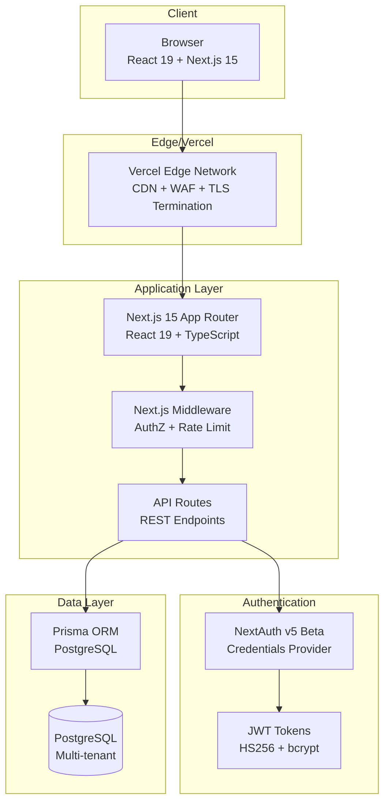

# Arquitetura e Superfície de Ataque

## Portal Porta de Entrada - Prefeitura de São Paulo

---

## 1. Visão Geral da Arquitetura

### 1.1 Diagrama de Alto Nível



### 1.2 Componentes Principais

| Camada | Tecnologia | Versão | Responsabilidade |
| ------ | ---------- | ------ | ---------------- |
| **Frontend** | Next.js 15 App Router | 15.1.0 | SSR/SSG, React 19, Server Components |
| **Auth** | NextAuth v5 | 5.0.0-beta.32 | Credentials + JWT |
| **Database** | Prisma + PostgreSQL | 6.19.3 | ORM + Row-level via middleware |
| **Styling** | Tailwind CSS | 3.4.17 | Utility-first CSS |
| **State** | React 19 + Server Components | 19.0.0 | Server/Client Components |
| **UI Components** | Custom + shadcn-like | Custom | Button, Input, Card, etc. |

---

## 2. Trust Boundaries (Fronteiras de Confiança)

| Boundary | Descrição | Controles |
| -------- | --------- | --------- |
| **Internet → Edge** | Vercel Edge Network | TLS 1.3, WAF, DDoS protection (Vercel managed) |
| **Edge → Application** | Vercel → Next.js | TLS 1.3, headers de segurança |
| **Client → Server** | Browser → Next.js | HTTPS only, CSP, HSTS |
| **Middleware → API Routes** | Middleware → API Routes | Role-based access control |
| **API Routes → Prisma** | Server-side only | Prepared statements (Prisma) |
| **Prisma → PostgreSQL** | ORM → Database | Prepared statements, TLS |
| **Client → NextAuth** | Browser → NextAuth | HTTPS, Secure cookies, CSRF protection |
| **NextAuth → Database** | Auth → Prisma | bcrypt cost 12, JWT HS256 |

### Fronteiras Críticas

| Boundary | Risco | Mitigação |
| -------- | ----- | --------- |
| **Browser → API** | XSS, CSRF, Injection | CSP, CSRF tokens, Prepared statements |
| **API → Database** | SQL Injection | Prisma prepared statements |
| **Auth → Session** | Session Hijacking | Secure cookies, HttpOnly, SameSite |
| **Admin → Data** | Privilege Escalation | Role-based middleware + API checks |
| **Tenant A → Tenant B** | Cross-tenant Access | Middleware + Prisma where clauses |

---

## 3. Superfície de Ataque (Attack Surface)

### 3.1 Pontos de Entrada (Entry Points)

| Tipo | Endpoints | Autenticação | Autorização |
| ---- | --------- | ------------ | ----------- |
| **Páginas Públicas** | `/`, `/busca`, `/docs`, `/fomento-a-cultura`, etc. | Nenhuma | Pública |
| **Autenticação** | `/auth/login`, `/auth/register`, `/api/auth/*` | Credentials/JWT | Pública (login) / JWT (session) |
| **Área Restrita** | `/cadastro` | JWT (VIEWER+) | Middleware + Role |
| **Admin** | `/admin/*` | JWT (ADMIN) | Middleware + Role |
| **API Pública** | `/api/cultura`, `/api/inscricoes` | JWT (VIEWER+) | Role-based |
| **API Admin** | `/api/admin/*` | JWT (ADMIN/EDITOR) | Role-based |
| **Auth API** | `/api/auth/*` | Credentials/JWT | NextAuth internals |

### 3.2 Endpoints de Alto Risco

| Endpoint | Método | Risco | Controles |
| -------- | ------ | ----- | --------- |
| `POST /api/inscricoes` | CREATE | PII exposure, BOLA | Auth + CPF validation + duplicate check |
| `GET /api/inscricoes` | READ | Data exposure | Role-based filtering (VIEWER=own only) |
| `PATCH /api/admin/inscricoes` | BULK UPDATE | Mass assignment, privilege escalation | ADMIN only + status validation |
| `POST /api/cultura` | CREATE | Data integrity | ADMIN/EDITOR only |
| `PUT/DELETE /api/cultura/[id]` | UPDATE/DELETE | Data loss | ADMIN/EDITOR + ADMIN only for DELETE |
| `POST /api/auth/register` | CREATE | Account enumeration, weak passwords | Rate limit (in-memory), bcrypt 12 |
| `POST /api/auth/[...nextauth]` | AUTH | Credential stuffing | bcrypt cost 12, rate limit |

### 3.3 Fluxos de Dados Sensíveis

| Fluxo | Dados | Classificação | Controles |
| ----- | ----- | ------------- | --------- |
| **Registro de Usuário** | name, email, passwordHash | PII + Credenciais | bcrypt cost 12, rate limit |
| **Inscrição em Programa** | nome, email, CPF, RG, endereço, telefone, portfolio, carta | PII Sensível | CPF validation, duplicate check, auth required |
| **Login** | email, password | Credenciais | bcrypt cost 12, JWT tokens |
| **Admin - Gestão Inscrições** | Todos os dados de inscrição | PII Sensível + Admin | ADMIN role + audit log |
| **Admin - Gestão Programas** | Programa metadata | Operacional | ADMIN/EDITOR role |

---

## 4. Crown Jewels (Ativos de Maior Valor)

| Ativo | Descrição | Classificação | Proteção |
| ----- | --------- | ------------- | -------- |
| **Dados de Inscrição** | CPF, RG, endereço, telefone, carta de intenção | **PII Sensível - LGPD** | Auth + AuthZ + CPF validation + Duplicate check |
| **Credenciais de Usuário** | Email + bcrypt hash | **Credenciais** | bcrypt cost 12, rate limit |
| **Tokens JWT** | Access/Refresh tokens | **Credenciais de Sessão** | HS256, HttpOnly, Secure, SameSite |
| **Chaves de API/Secrets** | NEXTAUTH_SECRET, DATABASE_URL | **Segredos de Infra** | .env (não versionado) |
| **Dados Admin** | Gestão de programas/inscrições | **Operacional Sensível** | Role ADMIN + audit log |
| **Sessões de Usuário** | JWT tokens | **Sessão** | HttpOnly, Secure, SameSite=Lax |

---

## 5. Fluxos Críticos de Ataque

### 4.1 Credential Stuffing → Account Takeover → Admin Access

```text
Attacker → Credential Stuffing (rate limit bypass)
    → Valid credentials found
    → Login successful (no MFA)
    → JWT token obtained
    → Access /admin (if ADMIN role)
    → Full admin panel access
```

**Mitigações atuais:** Rate limit (in-memory), bcrypt cost 12
**Gaps:** Rate limit in-memory (bypass em multi-instância), MFA não obrigatório para ADMIN

### 4.2 Cross-Tenant Data Access (BOLA/IDOR)

```text
Attacker (Tenant A) → Valid session
    → Access /api/inscricoes?id=victim_id
    → Server returns inscription data
    → Cross-tenant data exposure
```

**Mitigação atual:** Middleware + API filtering by `token.email` para VIEWER
**Gaps:** Nenhum identificado no código - implementação robusta com `where: { email: token.email }` para VIEWER

### 4.3 Privilege Escalation via Role Confusion

```text
Attacker (VIEWER) → Craft request to /api/admin/inscricoes PATCH
    → Role check bypass? → Admin actions
```

**Mitigação atual:** Middleware + API role checks (ADMIN required for PATCH)
**Gaps:** Nenhum identificado - role checks consistentes em middleware + API

### 4.4 Session Hijacking / Fixation

```text
Attacker → Steal JWT token (XSS, MITM, log leakage)
    → Use token as victim
    → Full account access
```

**Mitigações atuais:** HttpOnly, Secure, SameSite=Lax, JWT HS256
**Gaps:** Refresh token rotation não implementado; session fixation não testada

### 4.5 Supply Chain / Dependency Confusion

```text
Attacker → Compromised dependency (npm)
    → Malicious code in build
    → RCE in build or runtime
```

**Mitigações atuais:** Lockfiles (package-lock.json), versões fixas
**Gaps:** Trivy não executado; GHSA-69fq-xp46-6x23 não verificado; Actions não pinadas por SHA

---

## 5. Matriz de Ameaças STRIDE

| Componente | Spoofing | Tampering | Repudiation | Information Disclosure | DoS | Elevation of Privilege |
| ------------ | -------- | --------- | ----------- | ---------------------- | --- | ---------------------- |
| **Auth (Login/Register)** | Médio (cred stuffing) | Baixo | Médio | Baixo | Alto (rate limit fraco) | Médio (role confusion) |
| **Session/JWT** | Médio (token theft) | Baixo | Médio | Médio | Baixo | Médio (token replay) |
| **API Inscricoes** | Baixo | Baixo (Prisma) | Baixo | Médio (cross-tenant) | Baixo | Baixo (AuthZ forte) |
| **API Admin** | Baixo | Baixo | Baixo | Baixo | Baixo | Médio (role escalation) |
| **Auth (NextAuth)** | Médio | Baixo | Médio | Baixo | Baixo | Médio |
| **Database** | N/A | Baixo (Prisma) | N/A | Baixo (TLS) | N/A | N/A |
| **File Upload** | N/A | N/A | N/A | N/A | N/A | N/A |
| **Dependencies** | N/A | Alto (supply chain) | N/A | N/A | N/A | Alto (RCE via dep) |

---

## 6. Crown Jewels - Resumo de Proteção

| Crown Jewel | Proteção Atual | Gap Principal |
| ----------- | -------------- | ------------- |
| **Dados de Inscrição (CPF, RG, endereço)** | Auth + AuthZ + CPF validation | Cross-tenant bem protegido |
| **Credenciais (bcrypt 12)** | Hash forte + rate limit | Rate limit in-memory |
| **JWT Tokens** | HS256 + HttpOnly + Secure | Sem refresh rotation |
| **Admin Panel** | Role ADMIN + Middleware | MFA não obrigatório |
| **Segredos (.env)** | Não versionado | Sem secret manager/rotation |

---

## 7. Resumo da Superfície de Ataque

| Vetor | Exposição | Mitigação Atual | Prioridade de Hardening |
| ----- | --------- | --------------- | ----------------------- |
| **Credential Stuffing** | ALTA | Rate limit fraco, sem MFA | **CRÍTICA** |
| **Session Hijacking** | MÉDIA | JWT seguro, HttpOnly | ALTA |
| **Cross-tenant (BOLA)** | BAIXA | AuthZ robusta | BAIXA |
| **Privilege Escalation** | BAIXA | RBAC consistente | BAIXA |
| **Injection (SQL/XSS)** | BAIXA | Prisma + React escaping | BAIXA |
| **Supply Chain** | MÉDIA | Lockfiles apenas | ALTA |
| **DoS (Rate Limit)** | ALTA | In-memory apenas | **CRÍTICA** |
| **Session Fixation** | MÉDIA | Não testado | MÉDIA |
| **CSRF** | BAIXA | SameSite + CSRF tokens | BAIXA |

---

## 8. Resumo da Superfície de Ataque

O projeto **Porta de Entrada** possui uma arquitetura bem estruturada com **boas práticas de segurança implementadas** (Prisma para SQL injection prevention, NextAuth para auth, middleware para AuthZ, validação robusta de CPF/telefone/email).

**Principais gaps de segurança:**

1. **Rate limiting ineficaz em produção** (in-memory)
2. **MFA não obrigatório para roles privilegiadas**
3. **Refresh token rotation ausente**
4. **CSP incompleto** (apenas headers básicos)
5. **Logging/auditoria de segurança insuficiente**
6. **Supply chain não verificado** (Trivy, GHSA-69fq-xp46-6x23)

**Recomendação prioritária:** Implementar rate limiting distribuído (Redis/Upstash) + MFA obrigatório para ADMIN/EDITOR antes de ir para produção.
